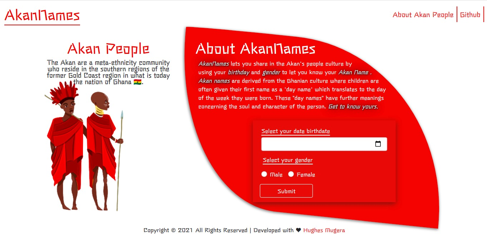

# AKANNAME

## Description
AkanName is a web application that assists users to know their Akan names based on their birth date and gender.Akan name comes from the AKan people who name their children after the day of the week they were born.This website takes a user's birthday and calculates the day of the week they were born and then depending on their gender, it outputs their Akan Name. Akan Names are from the Ghanain culture.
## Live site 
Visit the live site [Here](https://mugerah.github.io/akanName/)

## Preview

## Project Setup Instructions
* Open Terminal {Ctrl+Alt+T}
* git clone https://github.com/MugeraH/akanName.git
* cd akanName
* code . (for Vs Code) or atom .(for Atom)

Ensure the following stylesheets have also be linked to you project
* [Bootstrap 4](href="https://cdn.jsdelivr.net/npm/bootstrap@5.0.0-beta2/dist/css/bootstrap.min.css")

Script CDN
* [Javascript](https://cdn.jsdelivr.net/npm/bootstrap@5.0.0-beta2/dist/js/bootstrap.bundle.min.js)

## Technologies Used
1. HTML5
2. CSS
3. BootStrap
4. Javascript
5. Markdown

## Behaviour Driven Development

| Behavior| input | output |
| -------- | -------- | -------- |
| Site has form for user to select date of birth and select their gender and a submit button to be clicked once the form is filled .Invalid dates will cause an error message to appear | Selected user birth-date and gender   | User's Akan name based on the day of the week they were born and the day of the week   |

## Support and contact details
 Incase you come across errors, have questions, ideas ,concerns, or want to contribute to the page, feel free Fork this repo .

## Author
[Mugera Hughes](https://github.com/MugeraH)

## Contact Information
email (mugerahughes@gmail.com)
phone : 0710499070

### License
 [MIT License](https://github.com/MugeraH/akanName/blob/main/license) Copyright (c) {2021} 